# 🎓 Lecture Notes Pipeline

A fully local, privacy-first pipeline that transforms lecture videos into structured study notes using AI. **No data leaves your device.**

---

## 🎬 See It In Action

<!-- TODO: Add demo.gif here after recording -->
<!--  -->

### Before → After

| 📹 Input: Lecture Video | 📝 Output: Structured Notes |
|:-----------------------:|:---------------------------:|
|  |  |

> ⏱️ **A 2-hour lecture → ~44 min processing → Structured Markdown notes with timestamps, summaries, and action items! Working on reducing it more. Stay tuneddd...**

📄 **[View Sample Output →](preview_outputs/Introduction%20to%20Data%20Engineering_notes.md)** | 📋 **[View Action Items →](preview_outputs/Introduction%20to%20Data%20Engineering_action_items.md)**

---

## 🏗️ Architecture

```mermaid
flowchart LR
    subgraph Input
        A[📹 Video File<br/>MP4/MKV/AVI/WebM]
    end
    
    subgraph Processing
        B[🎵 FFmpeg<br/>Audio Extraction]
        C[🗣️ Whisper<br/>Speech-to-Text]
        D[🤖 Ollama LLM<br/>Note Generation]
    end
    
    subgraph Output
        E[📝 Notes.md<br/>Summaries & Concepts]
        F[✅ Action Items.md<br/>Homework & Deadlines]
    end
    
    A --> B --> C --> D
    D --> E
    D --> F
    
    style A fill:#e3f2fd,stroke:#1976d2
    style B fill:#fff3e0,stroke:#f57c00
    style C fill:#e8f5e9,stroke:#388e3c
    style D fill:#fce4ec,stroke:#c2185b
    style E fill:#e1f5fe,stroke:#0288d1
    style F fill:#e1f5fe,stroke:#0288d1
```



**Key Components:**
- **FFmpeg** - Extracts audio from video files
- **Whisper** - OpenAI's speech recognition (runs locally via faster-whisper)
- **Ollama** - Local LLM runtime for note generation
- **Caching** - Transcripts cached by video hash to avoid re-processing

---

## ✨ Features

- **100% Offline** - All processing happens locally
- **CPU Optimized** - Works great on systems without GPU
- **Smart Notes** - AI-generated summaries, key concepts, and study questions
- **Timestamps** - Notes linked to video timestamps for easy reference
- **Multiple Formats** - Supports MP4, MKV, AVI, WebM

## 💻 Requirements

| Component | Minimum | Recommended |
|-----------|---------|-------------|
| **RAM** | 8GB | 16GB |
| **Storage** | 5GB free | 10GB free |
| **Python** | 3.10+ | 3.11+ |
| **OS** | Linux, macOS, Windows (WSL) | Linux |

## 🚀 Quick Start

### 1. Clone & Setup

```bash
git clone https://github.com/BarryByte/lecture-notes-pipeline.git
cd lecture-notes-pipeline
bash setup.sh
```

The setup script will:
- Check Python version
- Install FFmpeg (if needed)
- Install Ollama (if needed)
- Create virtual environment
- Install Python dependencies
- Pull the recommended LLM model

### 2. Activate Environment

```bash
source venv/bin/activate
```

### 3. Process a Lecture

```bash
python main.py path/to/lecture.mp4
```

Your notes will be saved to `output/<video_name>_notes.md`.

## ⚙️ Configuration

### Command Line Options

```bash
python main.py lecture.mp4 [OPTIONS]

Options:
  --output, -o PATH       Output directory (default: ./output)
  --language, -l CODE     Language code, e.g., 'en', 'es' (default: auto)
  --whisper-model MODEL   Whisper model size (default: medium)
  --llm-model MODEL       Ollama model name (default: llama3.2:3b)
  --no-cache              Disable transcript caching
  --no-stream             Disable streaming output for notes
  --verbose, -v           Enable debug logging
  --help                  Show help message
```

### Model Options

#### Whisper (Speech-to-Text)

| Model | RAM | Speed | Accuracy | Use Case |
|-------|-----|-------|----------|----------|
| `small` | ~2GB | Fast | Good | Quick drafts |
| `medium` | ~4GB | Medium | Great | **Default** |
| `large-v3` | ~8GB | Slow | Best | Critical accuracy |

#### LLM (Note Generation)

| Model | RAM | Speed | Quality |
|-------|-----|-------|---------|
| `phi3:mini` | ~4GB | Fast | Good |
| `llama3.2:3b` | ~4GB | Fast | **Great** |
| `mistral:7b` | ~6GB | Medium | Excellent |

### Configuration File

Create `config.yaml` for persistent settings:

```yaml
whisper:
  model: medium
  language: null  # auto-detect

llm:
  model: llama3.2:3b
  temperature: 0.3

output:
  format: markdown
  include_timestamps: true
```

## 📊 Performance (16GB RAM, CPU)

| Lecture Length | Transcription | Notes | Total |
|----------------|---------------|-------|-------|
| 15 min | ~9 min | ~2 min | ~11 min |
| 60 min | ~36 min | ~8 min | ~44 min |
| 120 min | ~51 min | ~15 min | ~66 min |

*Times measured with `medium` Whisper + `llama3.2:3b`. Long lectures (>1hr) are automatically chunked for better note quality.*

> 💡 **Tip**: Transcripts are cached automatically. Re-running on the same video skips transcription entirely!

## 📁 Project Structure

```
lecture-notes-pipeline/
├── src/
│   ├── audio_extractor.py  # FFmpeg wrapper
│   ├── transcriber.py      # Whisper integration
│   ├── note_generator.py   # LLM note creation
│   └── utils.py            # Helpers
├── assets/                 # Screenshots & demo media
├── preview_outputs/        # Sample outputs for showcase
├── .cache/                 # Cached transcripts (auto-created)
├── output/                 # Generated notes (auto-created)
├── main.py                 # CLI entry point
├── config.yaml             # Settings
├── requirements.txt
├── setup.sh
└── README.md
```

## 🔧 Troubleshooting

### "Out of memory" error
- Use a smaller Whisper model: `--whisper-model small`
- Use a smaller LLM: `--llm-model phi3:mini`
- Close other applications

### Slow transcription
- This is normal for CPU-only systems
- Consider processing overnight for long lectures
- Enable caching to avoid re-transcription

### Poor transcription quality
- Use `--whisper-model large-v3` (slower but more accurate)
- Ensure good audio quality in source video
- Specify language explicitly: `--language en`

### Ollama not responding
```bash
# Restart Ollama service
sudo systemctl restart ollama
# Or start manually
ollama serve
```

## 🛡️ Privacy

- **No internet required** after initial setup
- **No data transmitted** - all AI runs locally
- **No telemetry** - zero tracking or analytics
- Transcripts cached locally in `.cache/` (gitignored)

Made with ☕ for students who hate taking notes
